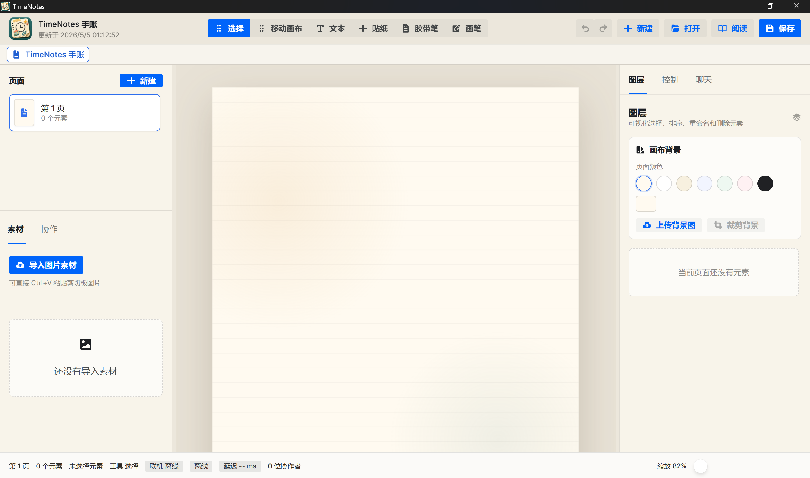

<p align="center">
  
</p>

<h1 align="center">TimeNotes</h1>

<p align="center">
  自由画布，无限创作——从文字手绘到音视频、3D 模型与代码块，一切元素随心摆放，打造你的专属数字手账。
</p>

<p align="center">
  
  
  
  
</p>

<p align="center">
  文本、图片、贴纸、音频、视频、3D 模型、代码块、GIF 动图、胶带笔迹和画笔笔迹都作为独立元素放置在画布上，支持拖拽、缩放、旋转、图层管理、多页编辑、Markdown 富文本、阅读预览、翻页动画、`.tnote` 单文件保存和多人实时协作（含语音通话）。
</p>

<p align="center">
  
  
  
</p>

<p align="center">
  
</p>

## 版本 2.9.0 更新摘要

- **Android 客户端（arm64）**：Wails3 Android WebView 壳；适配窄屏/平板布局、触控缩放与页面列表编排。
- **页面拖拽编排**：桌面 HTML5 拖拽与 Android 手柄触控排序分离，互不干扰；移动端长按可重命名/删除页面。
- **联机协作移动端**：允许 HTTPS 页面连接局域网 `ws://`（WebView 混合内容）；移动端默认强制应用层中转；跨设备须使用电脑局域网 IP。
- **多媒体控件**：视频、GLB 3D 模型、音频、代码块、GIF；资源导入走内容哈希去重。
- **Blog 桥接**：客户端可连接 TimeNotesBlog 上传/更新完整 `.tnote`（含 Android 原生 WebSocket 代理，规避混合内容限制）。
- **`.tnote` 格式版本 7**：含 models 等资源组；旧文件打开时自动迁移。

## 💝 支持项目

<p align="center">
  TimeNotes 是独立开发者用爱发电的开源项目，完全免费。<br/>
  如果它帮你写出了更棒的手账，欢迎请开发者喝杯咖啡 ☕
</p>

<p align="center">
  <a href="https://ifdian.net/a/algfwq">
    
  </a>
</p>

<p align="center">
  👉 <a href="https://ifdian.net/a/algfwq"><strong>前往爱发电支持 TimeNotes</strong></a>
</p>

## 当前能力

- 画布编辑：支持页面缩放、画布移动、元素拖拽、缩放、旋转、右键菜单、显式对齐线和页面/元素吸附。
- 多页笔记：左侧页面栏可新建、切换、删除、重命名和拖拽调整页面顺序（桌面拖拽 / Android 手柄触控）。
- 多标签页：顶部标签页可同时打开多个笔记或阅读视图，并支持切换、关闭和右键重命名。
- 图层管理：右侧图层栏可查看真实缩略图、选择、排序、重命名和删除元素（含触控排序）。
- 元素控制：右侧控制栏独立于图层栏，提供文本、图片、贴纸、画笔和胶带笔的属性设置。
- 文本能力：支持富文本编辑、Markdown 语法快捷输入与实时渲染、字体选择、系统字体导入打包、字号、颜色、背景和边框样式。
- 图片能力：支持图片素材导入、剪切板粘贴导入、GIF 动图导入与播放、画布放置、元素级裁剪和背景图裁剪。
- 贴纸能力：贴纸库独立于普通素材库，支持内置贴纸和用户上传贴纸；贴纸裁剪只影响当前元素，不污染贴纸库。
- 音频能力：支持音频素材导入与画布内嵌播放控件。
- 视频能力：支持视频素材导入与画布内嵌播放。
- 3D 模型：支持 GLB 格式 3D 模型导入与交互式渲染。
- 代码块：支持代码块控件，内置语法高亮。
- 绘制能力：画笔支持自由笔迹；胶带笔支持直线笔迹、宽度、颜色和图案样式。
- 协作模式：支持房主发起联机、邀请链接加入、房主审批、在线成员、远端鼠标、聊天、实时语音通话、P2P 优先和服务器中转兜底；Android 可连局域网协作服务。
- Blog 上云：连接 TimeNotesBlog 后可上传/更新完整手账。
- 阅读视图：优化阅读器界面，支持翻页动画，提供沉浸式笔记浏览体验。
- 本地日志：后端和前端关键事件写入同一个 `timenotes.log`，便于排查保存、打开、导入和 WebView 问题。
- 平台：Windows / macOS / Linux 桌面（Wails3）与 Android arm64。

## 技术栈

- 桌面框架：Go + Wails3
- 前端框架：React + TypeScript + Vite
- UI：Semi Design、Semi Icons、TailwindCSS
- 画布：DOM 元素层 + Konva 绘制层 + Moveable 变换控制
- 文本：Tiptap
- 协作：Yjs + WebSocket 信令 + WebRTC DataChannel，服务端为 TimeNotesServer
- 文件格式：`.tnote` ZIP 单文件包

## 项目结构

```text
.
├── main.go                         # Wails 应用入口和服务注册
├── document_services.go            # .tnote 新建、打开、保存、资源导入和导出服务
├── document_types.go               # .tnote 文档、页面、元素、素材等 Go 数据结构
├── logger.go                       # 后端日志和前端日志桥接
├── frontend/
│   ├── src/
│   │   ├── components/             # 顶栏、画布、图层、素材、阅读器等组件
│   │   ├── providers/              # 文档状态和协作状态
│   │   ├── lib/                    # 文件、字体、日志、ID 等工具
│   │   ├── data/                   # 内置贴纸等静态数据
│   │   └── assets/                 # Logo 和内置图片资源
│   ├── bindings/                   # Wails 生成的 TypeScript 绑定
│   └── package.json                # 前端依赖和构建脚本
├── build/                          # Wails 平台构建配置
├── AGENTS.md                       # Codex/工程协作规则
└── README.md
```

## 开发环境

需要本机已安装：

- Go
- Node.js / npm
- Wails3 CLI
- WebView2 Runtime，Windows 通常已自带或由系统安装

安装依赖时手动执行：

```powershell
npm install
cd frontend
npm install
```

## 常用命令

前端构建：

```powershell
cd frontend
npm run build
```

Go 测试：

```powershell
go test ./...
```

Go 构建：

```powershell
go build .
```

Wails 开发模式：

```powershell
wails3 dev
```

Wails 打包：

```powershell
wails3 package
```

修改导出的 Go 服务方法或类型后，需要重新生成前端绑定：

```powershell
wails3 generate bindings -clean=true -ts
```

## 开发服务器端口

前端开发服务器固定使用：

```text
127.0.0.1:9245
```

如果启动 `wails3 dev` 时出现端口占用：

```text
listen tcp 127.0.0.1:9245: bind: Only one usage of each socket address (protocol/network address/port) is normally permitted.
```

先检查端口：

```powershell
Get-NetTCPConnection -LocalPort 9245 -ErrorAction SilentlyContinue
netstat -ano | Select-String ':9245'
```

确认 PID 属于本项目此前启动的 Vite/Wails/Node 进程后再停止：

```powershell
Stop-Process -Id <PID> -Force
```

不要停止不属于本项目或用户仍在使用的进程。

## `.tnote` 文件格式

`.tnote` 是 TimeNotes 的可编辑源文件格式，本质是 ZIP 包。保存后的文件不依赖本机绝对路径，适合复制到其他设备继续打开编辑。

包内主要内容：

- `manifest.json`：格式版本、应用版本、资源索引和内部路径。
- `document.json`：页面、元素、素材引用、字体引用和样式快照。
- `yjs/update.bin`：Yjs 二进制状态。
- `assets/`：普通图片素材和背景图。
- `stickers/`：贴纸资源，独立于普通素材。
- `fonts/`：用户导入或系统字体打包后的字体文件。
- `audios/` / `videos/` / `models/`：音视频与 3D 素材（按格式版本逐步引入）。

当前应用版本 **2.9.0**，`.tnote` 格式版本 **7**，由后端和前端共同维护；结构变化需要显式迁移逻辑。

## 日志

应用启动时会创建 `timenotes.log`。优先写到可执行文件所在目录，例如：

```text
D:\TimeNotes\TimeNotes\bin\timenotes.log
```

日志写入时机包括：

- 应用启动和日志系统就绪。
- 新建、打开、保存 `.tnote`。
- 导入素材、导入字体、枚举系统字体。
- 导出页面或 HTML 的后端事件。
- 前端关键业务事件和捕获到的错误。
- Wails 或 Go panic/error。

日志只保留一个主文件，超过 2MB 会轮转为 `timenotes.log.1`。临时排障可用环境变量指定日志目录：

```powershell
$env:TIMENOTES_LOG_DIR = "D:\TimeNotes\logs"
```

## 联机协作

TimeNotes 的联机协作由桌面客户端和独立服务端共同完成。服务端项目地址：

[https://github.com/algfwq/TimeNotesServer](https://github.com/algfwq/TimeNotesServer)

协作流程：

1. 房主在左侧“协作”标签页填写服务端地址，例如 `http://127.0.0.1:8787` 或公网服务地址。
2. 房主点击“发起联机”，客户端调用 TimeNotesServer 创建房间，并得到邀请链接。
3. 邀请链接包含 `roomId` 和 `roomKey`。`roomKey` 只用于鉴权，不写入文档和日志。
4. 协作者通过邀请链接加入后，服务端先把连接置为待审批状态。
5. 房主收到 Semi 弹窗，选择同意或拒绝。只有同意后，协作者才真正进入房间并开始同步。
6. 房主可以在“在线状态”列表中右键某位协作者并将其踢出房间。
7. 房主退出协作时，房间关闭，其他协作者会自动退出，旧邀请链接失效。

同步内容：

- 画布文档状态使用 Yjs update 同步，服务端使用 SQLite 持久化第一阶段房间状态。
- 鼠标位置、当前页面、选中元素、正在编辑元素属于 presence，只在线传输，不写入 `.tnote`。
- 聊天消息只在线转发，不落库。
- 客户端之间优先建立 WebRTC DataChannel 直连传输；P2P 失败、断开或启用“强制服务器中转”时，同一协议消息走服务端 relay。

本机测试建议：

1. 启动 TimeNotesServer，并确认 `GET /healthz` 返回正常。
2. 打开两个 TimeNotes 客户端或两个独立浏览器窗口。
3. 用户甲发起联机，复制邀请链接。
4. 用户乙通过邀请链接加入，等待用户甲审批。
5. 审批通过后测试画布元素创建、拖动、文本字体、远端鼠标、页面切换、聊天和退出通知。
6. 勾选“强制服务器中转”后重复测试，确认 P2P 不可用时仍能协作。

跨设备或公网测试时，不要把服务端地址填成 `127.0.0.1`，应填写其他客户端可访问的局域网 IP、域名或 HTTPS 反向代理地址。Android 手机上 `127.0.0.1` 指向手机自身；局域网联机请填电脑 IP（例如 `http://192.168.x.x:8787`），或使用 `adb reverse tcp:8787 tcp:8787` 后再填本机地址。服务端须监听 `0.0.0.0:8787` 并配置 `secret`。

## 质量检查

提交或交付前建议至少执行：

```powershell
go test ./...
go build .
cd frontend
npm run build
```

涉及画布、裁剪、拖拽、对齐线、贴纸或阅读视图的改动，需要用真实浏览器或 Wails WebView 验证，而不是只通过静态构建判断。

## 开发约定

- `App.tsx` 只做应用组合入口，编辑器逻辑拆到组件和 hooks。
- 页面坐标使用画布坐标，不保存屏幕缩放后的像素。
- 选择框、hover、右键菜单、缩放缓存等 UI 临时状态不写入文档模型。
- 贴纸库和普通素材库保持独立。
- 字体必须打包进 `.tnote` 后才能保证其他设备正常展示。
- 打开 `.tnote` 时后端必须校验 ZIP 内路径，不能信任压缩包条目路径。
- 不要把 WebView2 profile/cache 当作项目业务数据保存到仓库。
